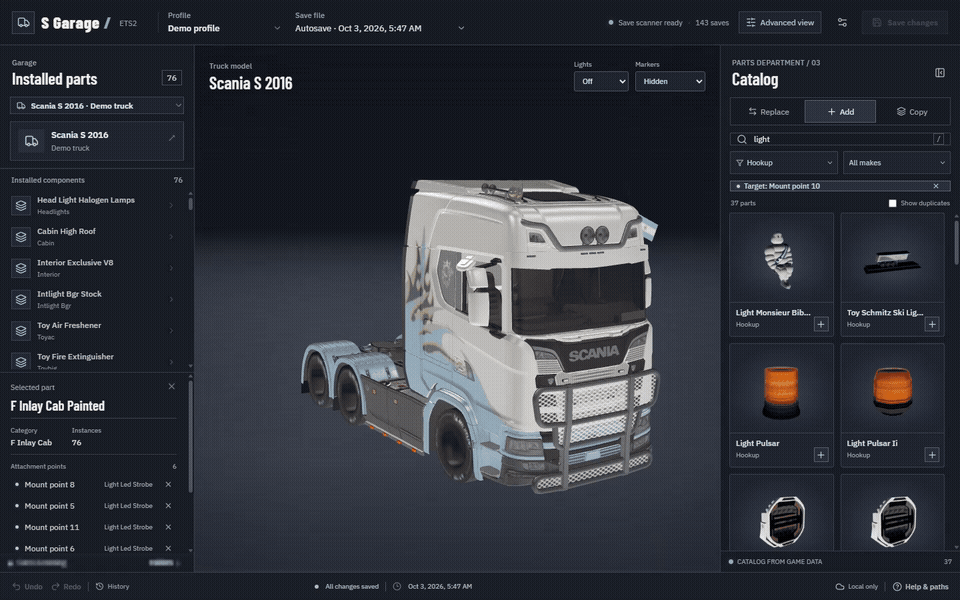

# S Garage · Euro Truck Simulator 2

**A free local 3D truck editor and save editor for ETS2.** Build your truck visually: mix accessories from different trucks, duplicate parts, explore attachment points, and preview changes before loading your save in the game.

**[Download for Windows](https://github.com/Senior-S/S-Garage-Euro-Truck-Simulator-2/releases)** · **[Installation guide](docs/INSTALLATION.md)** · **[User guide](docs/USER_GUIDE.md)** · **[Get help](https://github.com/Senior-S/S-Garage-Euro-Truck-Simulator-2/issues/new/choose)**

## See it before downloading

[Watch or download the full demo video](https://github.com/Senior-S/S-Garage-Euro-Truck-Simulator-2/releases/download/v0.1.0/S-Garage-demo.mp4).

These are real captures of the app using locally installed game assets. The preview approximates ETS2's rendering; lighting, materials, and some accessories can still look different in game. This is an **early preview release**.

## What you can do

- Open a profile and save, then choose any owned truck.
- Inspect the truck in 3D, including its interior, and select parts or attachment markers.
- Replace accessories, mix parts across trucks, and duplicate parts or hookups.
- Browse visual catalog previews that rotate on hover; duplicates stay hidden unless enabled.
- Undo and redo edits before saving.
- Preview lights in **Off**, **Low**, or **High** mode, including roof and auxiliary lights.
- Show **All** markers, the **Selected only** marker, or hide them completely.
- Enable **Advanced view** for internal names and supported save-field editing.

## Download and start

You need **Windows 10/11, 64-bit**, an installed copy of **Euro Truck Simulator 2**, and a browser with WebGL support. S Garage uses your installed game, DLC, and available mods. Game assets and saves are not included in the download.

1. Open the **[Downloads page](https://github.com/Senior-S/S-Garage-Euro-Truck-Simulator-2/releases)**. A GitHub account is not required.
2. Under **Assets**, download **`S-Garage-v0.1.0-Windows-x64.zip`**. Choose this file instead of GitHub's automatically generated “Source code” downloads.
3. Right-click the ZIP and select **Extract All**. Keep the extracted files together.
4. Open the extracted **S Garage** folder and double-click **`S Garage.exe`**.
5. Your browser opens the garage. Keep the small S Garage window open while editing; use **Stop garage** when finished.

**No Python, Node.js, Git, or installation wizard is needed for the portable download.** Game and profile folders are detected automatically; open **Settings** to select them yourself if necessary. First-time imports can take a while; later visits reuse local caches.

See the **[installation guide](docs/INSTALLATION.md)** for updating and troubleshooting.

## Your first truck edit

1. In ETS2, make a separate manual save for experimenting, then open that save in S Garage.
2. Choose your **Profile**, **Save file**, and **Truck**.
3. Click a part or marker, then choose an accessory from the catalog. Use **Undo** if you change your mind.
4. **Close ETS2 before clicking Save changes.** The app creates a backup before writing the selected save.
5. Start ETS2 and load the edited save to inspect the result.

Closing the browser keeps the local server running. Stopping S Garage ends the editing session; save your edits first. Light and marker controls only affect the preview.

More detail: **[User guide](docs/USER_GUIDE.md)** · **[Restore a save backup](docs/INSTALLATION.md#restore-a-save-backup)**.

## What to expect

Some unusual combinations have no compatible attachment point or behave differently in ETS2. Missing old mod accessories are skipped in the preview, while their saved entries remain intact. Flags and physics toys appear at rest. Workshop mods with ambiguous version packages and some specialized shaders need further support.

S Garage runs locally at `http://127.0.0.1:8765`. Your saves and imported game assets stay on your computer. Settings and caches are stored in `%LOCALAPPDATA%\ETS2Garage`.

## Help, contact, and support

**[Report a problem](https://github.com/Senior-S/S-Garage-Euro-Truck-Simulator-2/issues/new/choose)**, or add **`seniors` on Discord**. Include your S Garage version, ETS2 version, what you clicked, and a screenshot or error message. Remove personal paths and usernames from logs before sharing them.

S Garage is free. Voluntary support is welcome; contact **`seniors` on Discord** for donation details. Donations are not required to download or use the app.

## License and credits

The original code is **source-available under [PolyForm Noncommercial 1.0.0](LICENSE)**. Noncommercial use, modification, and sharing are permitted under its terms; commercial redistribution requires separate permission. Third-party components retain their own licenses—see **[third-party notices](THIRD_PARTY.md)**.

Euro Truck Simulator 2 and its game assets belong to **SCS Software**. S Garage is an unofficial community tool, unaffiliated with SCS Software.

For developers: **[Build and contribute](CONTRIBUTING.md)** · **[Technical documentation](docs/DEVELOPMENT.md)**.
