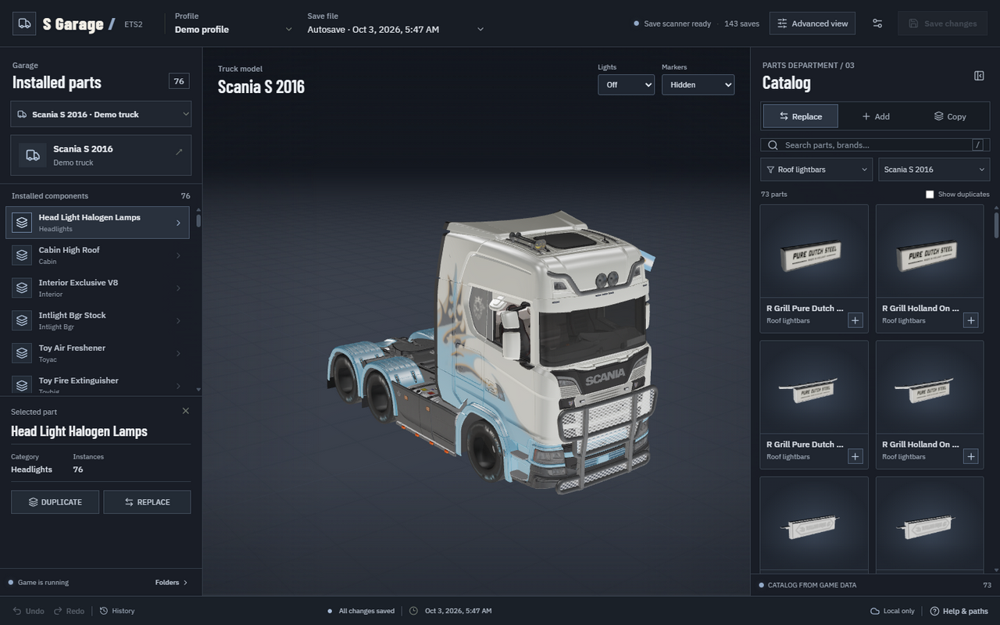

# Installing S Garage on Windows

[Back to the project](../README.md) · [User guide](USER_GUIDE.md)

## Requirements

- Windows 10 or 11, 64-bit.
- Euro Truck Simulator 2 installed locally, with the DLC and mods your truck uses.
- A browser with WebGL support, such as Edge, Chrome, or Firefox.
- Free disk space for extracted asset caches, which grow as you explore parts.

The portable download includes the runtime, interface, and conversion tools. You do not need a GitHub account, Python, Node.js, or Git.

## Download

Open **[S Garage downloads](https://github.com/Senior-S/S-Garage-Euro-Truck-Simulator-2/releases)**. Open the newest release and expand **Assets** if the files are collapsed. Download **`S-Garage-v0.2.1-Windows-x64.zip`**. For newer releases, choose the file ending in **`Windows-x64.zip`**.

“Source code (zip)” and “Source code (tar.gz)” contain developer files, rather than the ready-to-run app. The separate ConverterPIX and SII Decrypt source archives are provided for license compliance; you do not need them to run S Garage.

## Extract and launch

Right-click the ZIP in File Explorer → **Extract All**. Choose a writable folder, such as `Documents\S Garage`, then open the extracted **S Garage** folder.

Keep **S Garage.exe** and **_internal** together. Moving only the EXE prevents the app from finding its interface and tools.

Double-click **S Garage.exe**. A small launcher window appears and your browser opens `http://127.0.0.1:8765`. Keep the launcher open while editing. **Open garage** reopens the browser; **Stop garage** stops the server. The launcher asks before discarding unsaved edits.

This initial download is unsigned. If Windows shows a publisher warning, verify that you downloaded it from this repository's release page and review it before running it. Do not disable your security software. `SHA256SUMS.txt` provides checksums for verification.

## Find your game and saves

Steam installations and the Windows Documents folder are detected automatically, including libraries on other drives. `steam_profiles` is checked alongside `profiles`.

If detection fails, open **Settings**:

- **Game folder:** the ETS2 folder containing `.scs` archives. In Steam, right-click ETS2 → **Manage → Browse local files**.
- **Profiles folder:** usually `Documents\Euro Truck Simulator 2\profiles`. OneDrive can change the Documents location.
- **Converter / decryptor:** normally use the bundled tools.

Choose your **Profile**, **Save file**, and **Truck**. Saves are ordered newest first. The first catalog/model import may take time; imported data is reused afterward.

## Save and load in ETS2

Make a separate manual save in ETS2 for your first experiment. Open it in S Garage and edit your truck.

**Saving with ETS2 open is supported, with a warning.** Load the edited save before saving again in game, or ETS2 may overwrite your changes. The app still refuses to overwrite a save changed externally since opening it; reopen the updated save instead.

Start ETS2 and load the edited save. Steam Cloud synchronization remains Steam's responsibility.

## Update or uninstall

Save your edits and stop the garage before updating. Extract the newer Windows ZIP into a new folder and run its EXE. Settings remain in `%LOCALAPPDATA%\ETS2Garage`. Imported data defaults to its `cache` subfolder. You can change **Cache folder** in **Folders**; the new folder is created if needed, and the cache rebuilds as you browse. Existing cache files remain in the old folder.

To uninstall, stop the garage and delete its extracted folder. Optionally delete `%LOCALAPPDATA%\ETS2Garage` to remove settings and the default cache. If you selected another cache folder, delete it separately if desired. ETS2 saves and backup folders are separate.

## Restore a save backup

1. Close ETS2 and stop S Garage.
2. Find the edited save folder: typically `Documents\Euro Truck Simulator 2\profiles\<profile>\save\<save>`.
3. Open **garage-backups**, then the timestamped backup you want.
4. Copy its backed-up files into the original save folder, replacing the corresponding files. Keep a copy of current files if you may want them later.
5. Start ETS2 and load the restored save.

## Troubleshooting

| Problem | What to try |
| --- | --- |
| App does not start | Extract the entire ZIP again; keep `_internal` beside the EXE. Read `%LOCALAPPDATA%\ETS2Garage\server-errors.log`. |
| Browser tab closed | Click **Open garage** in the launcher. |
| Port 8765 occupied | Stop another running garage instance, or the other app using that port. |
| No profiles or saves | Check Settings and create a manual save in ETS2. Confirm the profiles folder matches the one the game uses. |
| Blank 3D view | Check hardware acceleration and graphics drivers; try another WebGL-capable browser. |
| Missing part | Confirm its DLC/mod is installed. Missing old-mod hookups are skipped during preview. |
| Save refused | If the save changed externally, reopen it and reapply your edits. |
| Edited save fails in game | Restore its backup and report the versions, changed part, and error message. |

Help: **[GitHub issues](https://github.com/Senior-S/S-Garage-Euro-Truck-Simulator-2/issues/new/choose)** or Discord **`seniors`**. Do not share private saves or unredacted logs publicly.
