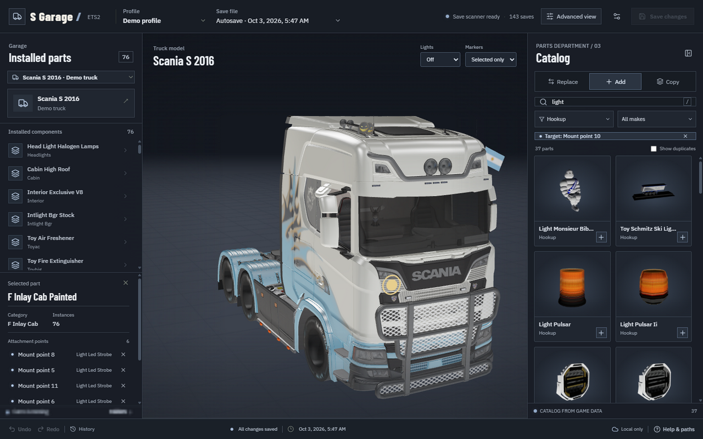

# Using S Garage

[Installation](INSTALLATION.md) · [Back to the project](../README.md)

## Choose a truck

Select **Profile**, **Save file**, then an owned **Truck**. Switching trucks cancels the previous model load. Opening a save reads a temporary decrypted copy; the original changes only when you click **Save changes**.

## Explore

Drag to orbit and scroll to zoom, including inside the cab. Click a fitted part or marker to choose its category; the installed-parts list works too. Overlapping markers show a chooser so you can select the intended point.

| Preview control | Options |
| --- | --- |
| Lights | **Off** by default; **Low** for low beams and position lights; **High** adds high beams and auxiliary lights. |
| Markers | **All** by default; **Selected only** keeps the selected marker visible; **Hidden** clears the view. |

These controls do not change your save.

## Choose accessories

Selecting a part or marker switches the catalog category. Search and filter by make to find parts. Choosing another marker in the same category keeps your search.

Hover over a catalog preview to rotate it. Equivalent definitions are hidden initially; enable **Show duplicates** to display them all. Some definitions, such as engines, have no visible mesh.

**Replace** changes the selected part or hookup. **Add** fits an accessory or fills an empty marker. Filling a marker switches it to Replace. **Copy / Duplicate** creates an independent instance; it may overlap the original because ETS2 controls attachment placement.

Mixed-brand parts can lack a compatible locator or behave differently in game. Always inspect the final result in ETS2.

## Paint your truck

Click **Paint** above the 3D view, or select the installed paint job. The catalog shows paint jobs from your installed game, DLC, and mods for the current truck and cab. Designs with artwork show that artwork on your selected cab, using the paint's default colors. Hover over a preview to rotate it and see both sides. Plain-color paints keep their color swatches.

Only visible previews load, and thumbnails are cached locally. Switching categories cancels unfinished previews. Browsing or hovering over a paint does not change your truck or its edit history.

Choose a paint job to apply it to the truck preview. In **Paint colors** on the left, change the base, design, metallic-flake, or flip colors supported by that paint job, then click **Apply colors**. Colors marked **Locked** cannot be edited for that design. Each application is one undoable change; your save is written only when you click **Save changes**.

The preview approximates the game's paint shaders, including metallic finishes. Inspect the result in ETS2 after saving.

Switching paint jobs carries your whole palette if you customized any color. If the current paint still has its default palette, the new paint uses its own defaults. Locked colors always follow the new design. **Reset colors**, beside **Apply colors**, restores the selected paint's original palette immediately; you can undo that reset.

## Undo and advanced controls

Use the bottom **Undo / Redo** buttons or **Ctrl+Z / Ctrl+Y**. Text inputs keep normal editing shortcuts. Undoing an added hookup clears its marker and returns it to Add mode.

Click **History** to see changes across all trucks in the loaded save. Click an applied change to undo it and all later changes at once, or **Opened save** to undo everything. Dimmed changes can be restored with their **Redo** action. Making a new edit after undoing discards the redo branch.

History lasts for the running server session. Stopping the app clears history and unsaved edits. Browser tabs share one session; reload a stale tab before editing.

**Advanced view** reveals internal names, paths, and supported instance fields such as paint colors and wheel offsets. Arbitrary positioning is not available for every accessory because ETS2 does not support a universal accessory transform in saves.

## Save

Close ETS2, click **Save changes**, then start ETS2 and load the edited save. A backup is created before writing. Keep an experimental manual save while trying unusual combinations.

To reverse a saved change after ending the session, **[restore a backup](INSTALLATION.md#restore-a-save-backup)**.
